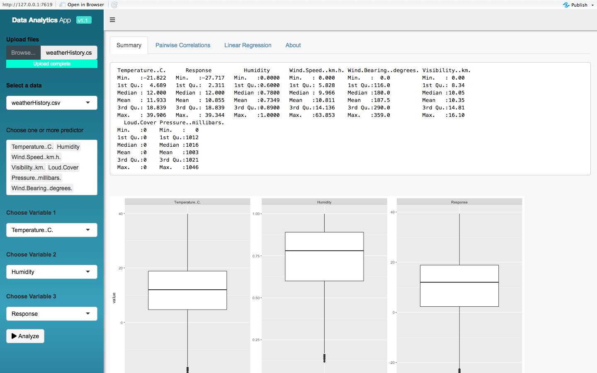
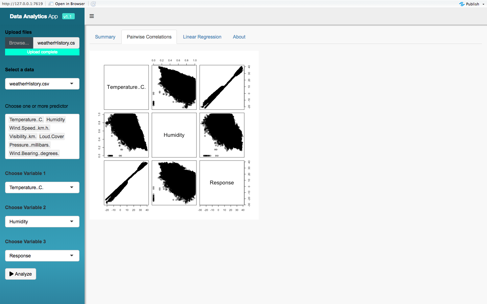
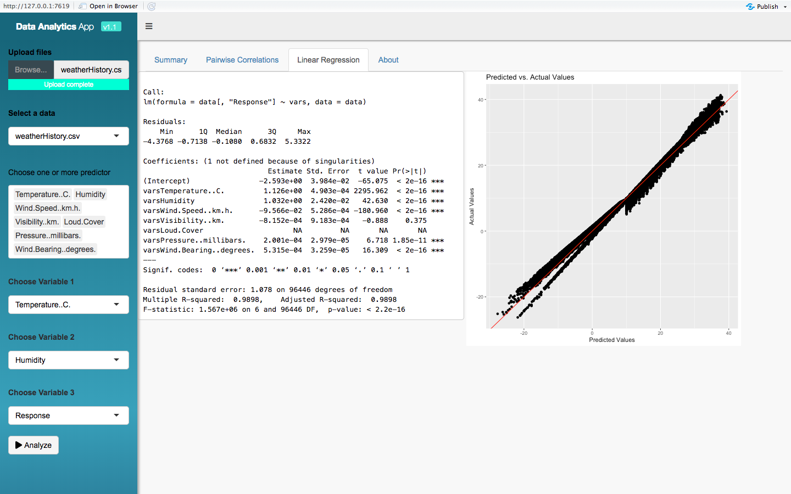

This is an [R Markdown](http://rmarkdown.rstudio.com) Notebook to show you how to build an app using R shiny dashboard. 

There are many sources available that contains the basics of buiding an app, e.g., [R Shiny](https://shiny.rstudio.com/articles/build.html). Thus, such topics are excluded from this notebook.

Dashboard panels, tabPanels and dashboard sidebar need to be defined in the following block.


```{r eval=FALSE, include=FALSE}
ui <- dashboardPage(
  # Dashboard items here.
)
```

For instance, the sidebar as shown in the image below. Multiple controling options are designed. As you see the input file can be csv format and the option multiple defines the acceptance multiple files upload at the same. At the end an action button is defined.
```{r eval=FALSE, include=FALSE}
# Do not Run
dashboardSidebar(width = 250,title = "", collapsed = FALSE,
                                     # Input: Select a file ----
                                     fileInput("files", "Upload files",
                                               multiple = TRUE,
                                               accept = c("text/csv",
                                               "text/comma-separated-values,text/plain",".csv")),
                                     uiOutput("file"),
                                     uiOutput("multiplecolumns"),
                                     uiOutput("column1"),
                                     uiOutput("column2"),
                                     uiOutput("column3"),
                                     actionButton("run_analysis","Analyze",icon=icon("play"))
                    )

```



All the inputs in the side bar should be described in the server section.
```{r eval=FALSE, include=FALSE}
server <- function(input, output) {
  # Inputs here
}

```


For instance, getting two inputs of multiple choices and a single drop down input.

```{r eval=FALSE, include=FALSE}
# Do not Run
  output$column1 <- renderUI({
    data<-chosendata()
    
    selectInput(inputId = "column1", label = HTML('<p style="black">Choose Variable 1</p>'), choices=names(data),selected = "")
  })

### Multiple inputs as predictors
# Note that only numerical vatiables will be generated as choices
  output$multiplecolumns <- renderUI({ 
    data<-chosendata()
    numericcolumns<-unlist(lapply(data, is.numeric))  
    namesofcolumns<-names(data[,numericcolumns])
    selectInput(inputId ="multiplecolumns", label = h5("Choose one or more predictor"), 
              choices = namesofcolumns, multiple = TRUE)
    })
```

Once all the inputs are defined and selected, they can be used for further plotting or any statistic that its result will be saved in an output variable.

```{r eval=FALSE, include=FALSE}
pairs(data[,c(input$column1,input$column2)])
```



Given a data that has a number of features and one response variable. To build a regression model upon that, user's selections of the predictors will be used as variables and the 'Response' variable will be the response variable. 

```{r eval=FALSE, include=FALSE}

#### Models for prediction 
# Any model can be written here or in a separate script. Then the script can be imported using source("model.R")
  
  regmodel <- eventReactive(input$run_analysis,{
    selectedvariables<-input$multiplecolumns
    data<-chosendata()
    vars <- as.matrix(data[, selectedvariables])
    lm(data[,'Response'] ~ vars,data)
    
  })
  
  
  output$modelsummary<-renderPrint({ 
    
    summary(regmodel())
    
  })
  
  
  output$modelpredict<- renderPlot({
    data=chosendata()
    ggplot(data, aes(x=Response, y=predict(regmodel()))) + 
      geom_point() +
      geom_abline(intercept=0, slope=1,color='red') +
      labs(x='Predicted Values', y='Actual Values', title='Predicted vs. Actual Values')
    

    
    
  })
```


